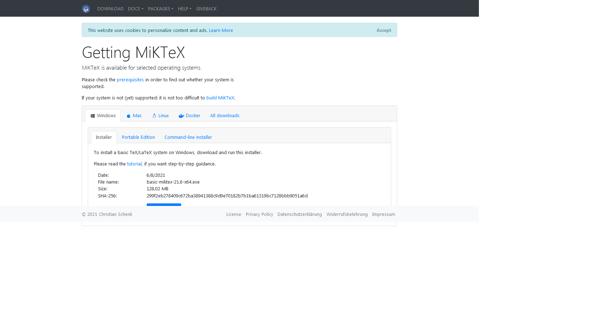
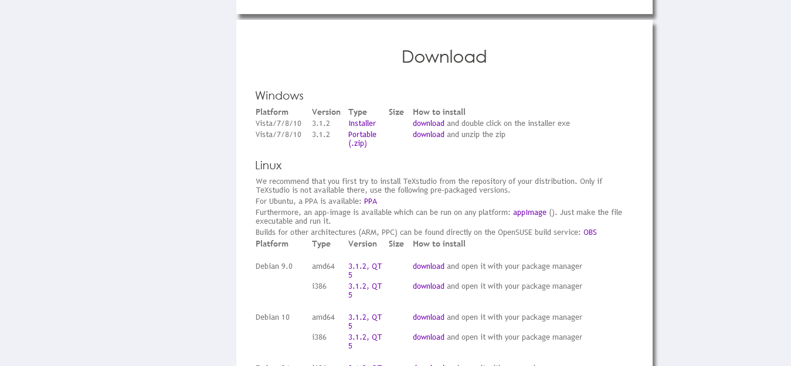

## 1- लेटेक्स स्थापित करना

##### आपकी लेटेक्स यात्रा के पहले चरण में आपका स्वागत है। यहां हम लेटेक्स इंस्टॉल करना सीखेंगे, यह बहुत आसान है। आप इसे केवल 2 चरणों में प्राप्त कर लेंगे:

यदि आप अभी भी मौसम के बारे में सुनिश्चित नहीं हैं कि आप लाटेक्स पसंद करेंगे या नहीं, तो इस चरण को छोड़ना और इसके बजाय [ओवरलीफ](https://www.overleaf.com/) का उपयोग करना एक अच्छा विचार हो सकता है।.

1. अपने ऑपरेटिंग सिस्टम के लिए [MiKTeX](https://miktex.org/download) से TeX/LaTeX वितरण डाउनलोड और इंस्टॉल करें .

###### यदि आप MiKTeX के बारे में अधिक जानना चाहते हैं तो उनके [संगठन](<(https://github.com/MiKTeX)>) में जाएं और उनके भंडार देखें !

**MiKTeX को स्थापित करते समय एक निश्चित बिंदु पर यह हमें पैकेजों को स्थापित करने के तरीके के बारे में एक विकल्प देगा, हम आपको "ऑन द फ्लाई" विकल्प चुनने की सलाह देते हैं।**

2. एक लाटेक्स संपादक चुनें

हमारे पास यहां कुछ विकल्प हैं, मैं आपको अपनी कुछ व्यक्तिगत सिफारिशें दूंगा:

**TexStudio**: आप इसे [यहां](https://www.texstudio.org/) डाउनलोड कर सकते हैं। TeXStudio का उद्देश्य LaTeX लेखन को यथासंभव आसान और आरामदायक बनाना है। यही कारण है कि इसमें कई विशेषताएं हैं जैसे कि एक एकीकृत टोपी का छज्जा, वाक्य रचना परिणाम और कई अन्य के बीच ग्रंथ सूची सहायता।

###### यदि आप TeXStudio के बारे में अधिक जानना चाहते हैं तो [यहां](https://github.com/texstudio-org) क्लिक करें

**TeXnicCenter**: आप इसे [यहां](https://www.texniccenter.org/download/) डाउनलोड कर सकते हैं। TeXnicCenter अन्य चीजों के साथ एक एकीकृत टोपी का छज्जा और स्वत: पूर्णता के साथ एक स्वच्छ और आधुनिक यूजर इंटरफेस प्रदान करता है।

###### यदि आप TeXnicCenter के बारे में अधिक जानना चाहते हैं तो [यहां](https://sourceforge.net/projects/texniccenter/) क्लिक करें

**WinEdt**: केवल विंडोज़ उपयोगकर्ता। आप इसे [यहां](http://www.winedt.com/download.html) डाउनलोड कर सकते हैं। भुगतान कार्यक्रम - 31 दिनों का निःशुल्क लाइसेंस। WinEdt हमें बहुत से उपयोगी कमांड और संशोधित शॉर्टकट प्रदान करता है, जिससे लेटेक्स लेखन तेज हो जाता है।

###### उनका [होमपेज](http://www.winedt.com/about.html) देखें

लेटेक्स के साथ शुरुआत करने के लिए आपको बस इतना ही करना होगा। स्वागत हे!

[अगले भाग](https://github.com/Uklizdev/LaTeX-Guide/blob/master/Guide/2-%20Document%20Formats.md) पर जाएँ

**उपयोगी कड़ियाँ**

[CTAN](https://ctan.org/)
