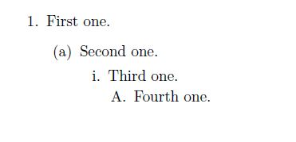
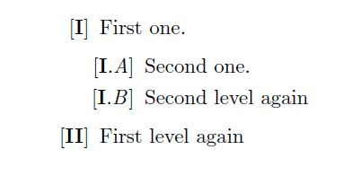
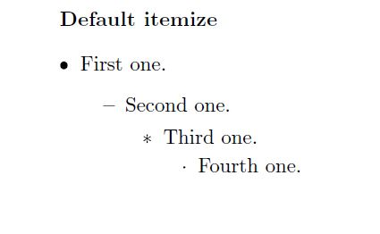
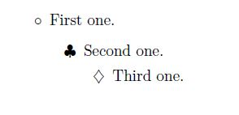

## सूचियाँ और कॉलम

##### पिछली बार हमारे पास बहुत सारे फ़ॉन्ट आकार और शैलियों के साथ एक दस्तावेज़ था, लेकिन यह सूचियों या स्तंभों का उपयोग करके बेहतर दिखता। आइए सूचियों से शुरू करते हैं।

### सूचियां

In LaTeX there are 3 types of lists, and as always, their names are super self explanatory.

1. `Enumerate`: सूची में प्रत्येक आइटम को क्रमांकित किया जाता है, जब भी हम _enviroment_ को कॉल करते हैं, तो संख्याएं 1 से शुरू होती हैं।
2. `Itemize`: प्रत्येक आइटम का एक निर्धारित प्रतीक होता है (आप जो प्रतीक चाहते हैं उसे बदल सकते हैं),
3. `Description`: प्रयुक्त आप प्रत्येक आइटम में अपना खुद का लेबल जोड़ते हैं। चरणों के लिए उपयोगी।

वस्तुओं को सूचीबद्ध करने के यह 3 तरीके 3 अलग-अलग वातावरण हैं और प्रत्येक आइटम को env के अंदर `\item` कमांड के साथ जोड़ा जाता है। यहाँ एक उदाहरण है:

```latex
\begin{enumerate}
        \आइटम एन्यूमरेट एनवायरमेंट में यह आइटम 1 है।
        \item यह दूसरा वाला है!
	\end{enumerate}

	\begin{itemize}
	    \आइटम बुलेट प्रकार आइटम।
		\item अगर मैं और जोड़ दूं, तो वे सभी बुलेट होंगे।
	\end{itemize}

	\begin{description}
        \आइटम [स्टेप १:] प्याज काट लें।
    \आइटम [स्टेप २:] तेल डालें।
	\end{description}
```

<div align="center">

</div>

अब तक यह आसान है और, ईमानदार होने के लिए, थोड़े उबाऊ। लेकिन यह लेटेक्स है, और हम जानते हैं कि लेटेक्स हमेशा मज़ेदार होता है क्योंकि आप दस्तावेज़ को **सटीक** जैसा आप चाहते हैं वैसा दिखने के लिए आप जो चाहें कर सकते हैं। चलिए इसे मज़ेदार बनाते हैं!

#### नेस्टेड सूचियां

हमारे द्वारा पहले उपयोग किए गए प्रत्येक वातावरण का उपयोग _inside_ उसी या किसी अन्य प्रकार के किसी अन्य वातावरण को डिफ़ॉल्ट कॉन्फ़िगरेशन में शामिल किए जाने के 4 स्तरों तक किया जा सकता है। और इसके साथ, हम कुछ इस तरह समाप्त कर सकते हैं:

```latex
\begin{itemize}
    \item {\tt itemize} में प्रथम स्तर
    \begin{गणना}
		\item First level in {\tt enumerate} (विश्व स्तर पर दूसरा स्तर)
		\begin{itemize}
			\item Second level in {\tt enumerate}
			(विश्व स्तर पर तीसरा)
			\begin{enumerate}
				\item Second in {\tt enumerate}
				(विश्व स्तर पर चौथा)
				\item Second element in fourth level
			\end{enumerate}
			\item Back to third level globaly (second
			in {\tt itemize})
		\end{itemize}
		\item Second level (first one in {\tt enumerate})
	\end{enumerate}
	\item First level
\end{itemize}
```

<div align="center">

</div>

चीजें अब बेहतर होने लगी हैं, लेकिन यह अभी भी थोड़ा अजीब है, क्या होगा अगर मुझे उस दूसरे आइटम में `-` पसंद नहीं है (और मैं नहीं)। सौभाग्य से हमारे लिए, इसे बदलने का एक तरीका है !!

#### आइटम शैलियों को बदलना

केवल एक ही वातावरण जिसे हम वास्तव में बदलना चाहते हैं, वह है `गणना` और `आइटमाइज़` क्योंकि `विवरण` में हम वह कर सकते हैं जो हम पहले से चाहते हैं।

###### **'गणना' बदलना**

लेटेक्स हमारे आइटमों की गणना करने का डिफ़ॉल्ट तरीका इस प्रकार है:

```latex
\begin{enumerate}
	\item First one.
	\begin{enumerate}
		\item Second one.
		\begin{enumerate}
			\item Third one.
			\begin{enumerate}
				\item Fourth one.
			\end{enumerate}
		\end{enumerate}
	\end{enumerate}
\end{enumerate}
```

<div align="center">

</div>

प्रत्येक स्तर को एक कमांड द्वारा दर्शाया जाता है: `\theenumi`, `\theenumii`, `\theenumiii` और `\theenumiv`। और प्रत्येक लेबल में उपयोग किए जाने वाले लेबल `\labelenumi`, `\labelenumii`, `\labelenumiii`, `\labelenumiv` हैं। और अगर हम `एन्यूमरेट` के व्यवहार को बदलना चाहते हैं, तो हमें `\renewcommand{old comand}{new command}` कमांड का उपयोग करके _redefine a कमांड_ नामक कुछ करना होगा (क्या आपने नहीं देखा कि कोई आ रहा है?) हमारे गणना पर्यावरण। अगर हम केवल पहले दो को बदलना चाहते हैं, तो पहले स्तर में रोमन संख्या दिखाने के लिए और दूसरे में रोमन। अक्षर इस तरह दिखेगा

```latex
%redefining the first level with \Roman, \roman would be i, ii, iii...
\renewcommand{\theenumi}{\Roman{enumi}}
\renewcommand{\labelenumi}{[\textbf{\theenumi}]}
%redefining the second level with \Alph, \aoman would be a, b, c...
\renewcommand{\theenumii}{\Alph{enumii}}
\renewcommand{\labelenumii}{[\textbf{\theenumi}.\textit{\theenumii}]}
\begin{enumerate}
	\item First one.
	\begin{enumerate}
		\item Second one.
		\item Second level again
	\end{enumerate}
	\item First level again
\end{enumerate}
```

<div align="center">

</div>

###### **`आइटमाइज़' बदलना**

पहले की तरह, हमारे पास डिफ़ॉल्ट आइटम हैं:

<div align="center">

</div>

अब आइटम के लिए हमारे पास `\labelitemi`, `\labelitemii`, `\labelitemiii`, `\labelitemiv` कमांड हैं। और वे मान ले सकते हैं जैसे: `\blacksquare`, `\textbullet`, `\circ`, `\clubsuit` या `\ Diamond`। **यह मान `$`** के बीच होना चाहिए। ध्यान दें कि यहां आइटम के बीच ऑर्डर के बारे में बात करना जरूरी नहीं है जैसा कि हमने `एन्यूमरेट` वातावरण में `थीनुमी` के साथ किया था, क्योंकि आइटमाइज़ केवल लेबल का उपयोग करता है। यहाँ एक उदाहरण है:

```latex
\renewcommand{\labelitemi}{$\circ$}
\renewcommand{\labelitemii}{$\clubsuit$}
\renewcommand{\labelitemiii}{$\diamondsuit$}
\begin{itemize}
	\item First one.
	\begin{itemize}
		\item Second one.
		\begin{itemize}
			\item Third one.
		\end{itemize}
	\end{itemize}
\end{itemize}
```

<div align="center">

</div>

आइटम लेबल (`\circ`,`\diamond`) का मूल्य `$` के बीच जाने का कारण कुछ ऐसा है जिसे हम अगली बार बेहतर ढंग से समझेंगे, जब हम समीकरणों के बारे में बात करेंगे!
