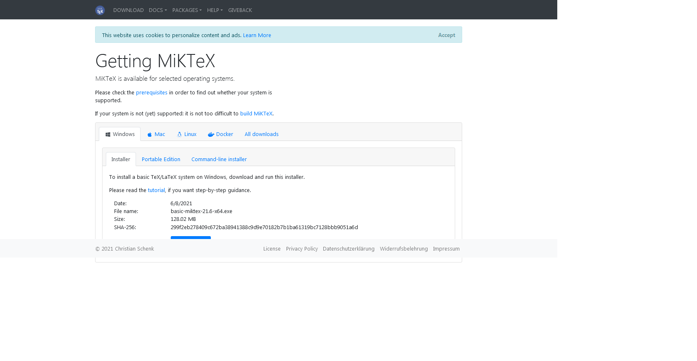
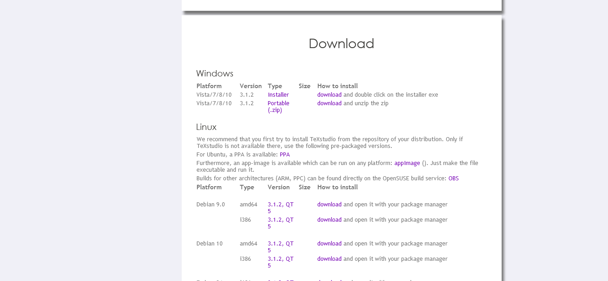
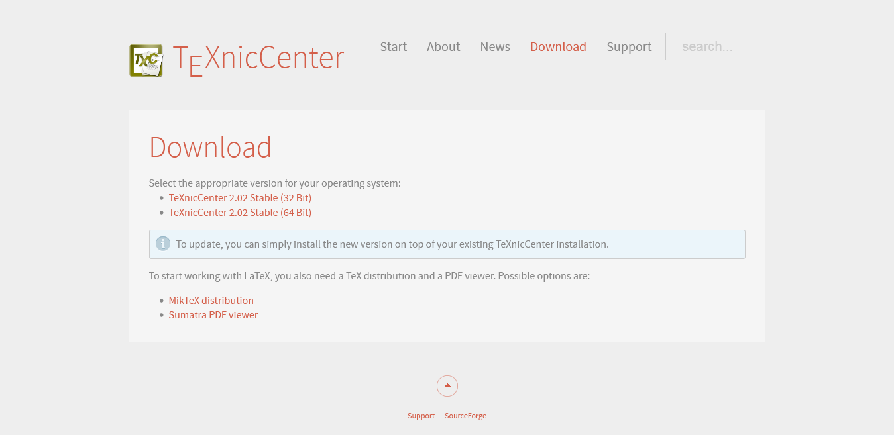
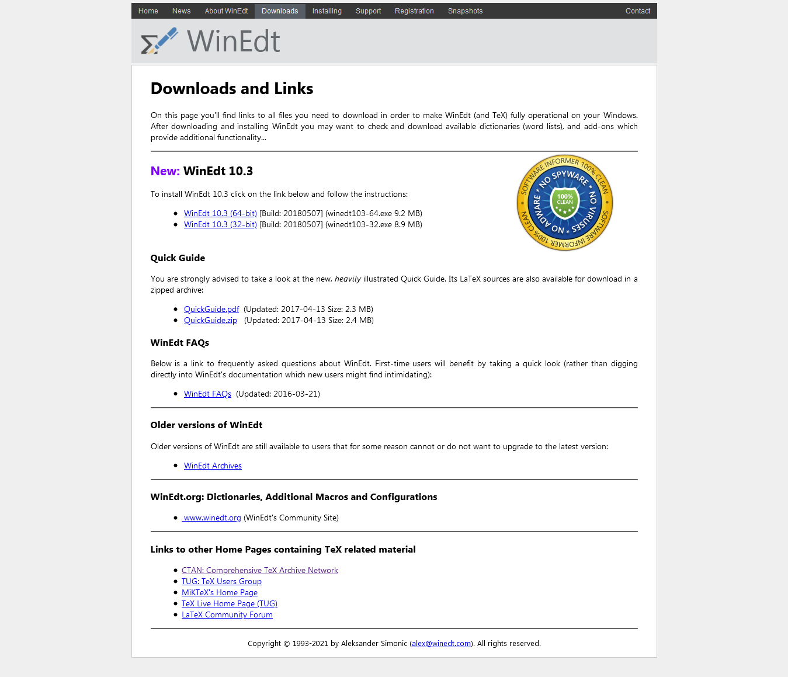

## 1- Installing Latex

##### Welcome to the first step in your Latex journey. Here we will learn to install latex, it's super easy. You'll get it up and runnig in just 2 steps:

If you are still not sure of weather you'll like LaTeX or not, it might be a good idea to skip this step and instead use [Overleaf](https://www.overleaf.com/).

1. Download and install the TeX/LaTeX distribution from [MiKTeX](https://miktex.org/download) for your operating system.

###### if You wanna know more about MiKTeX go to their [organization](https://github.com/MiKTeX) and check out their repositories!

**At a certain point when installing MiKTeX it will give us an options about how to install packages, we recommend you choosing the option "On the fly".**

2. Choose a LaTeX Editor

We have quite a few options here, I will give you some of my personal recommendations:

**TeXStudio**: You can dowload it [here](https://www.texstudio.org/). TeXStudio's objective is to make LaTeX writing as easy and comfortable as possible. That's why it has numerous characteristics such as an integrated visor, syntaxis results and bibliography assistance among many others.

###### if You wanna know more about TeXStudio click [here](https://github.com/texstudio-org)

**TeXnicCenter**: You can dowload it [here](https://www.texniccenter.org/download/). TeXnicCenter provides a clean and modern user interface with an integrated visor and autocompletition among other things. 

###### if You wanna know more about TeXnicCenter click [here](https://sourceforge.net/projects/texniccenter/)

**WinEdt**: Windows users only. You can dowload it [here](http://www.winedt.com/download.html). Paid program - 31 days free licence. WinEdt provides us with lots of useful commands and modifiable shortcuts, making latex writing faster.

###### Check out their [homepage](http://www.winedt.com/about.html)

That's all you needed to do to get started with Latex. Welcome!

Go to [next Section.W](https://github.com/Uklizdev/LaTeX-Guide/blob/master/Guide/2-%20Document%20Formats.md)

**Useful links**

[CTAN](https://ctan.org/)
