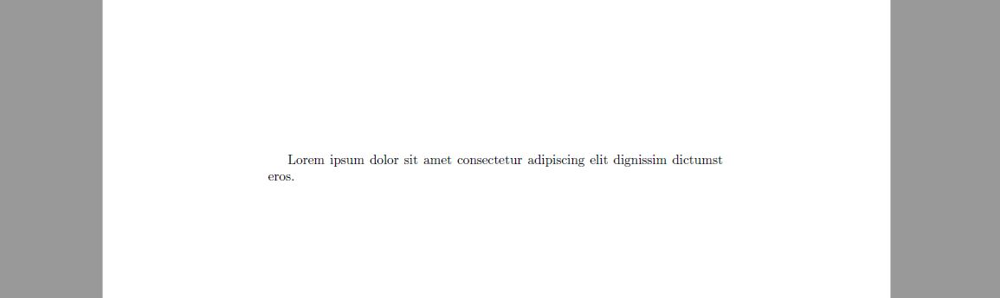

## Document formats

##### In this second "class" I will explain how to format your LaTeX document.  

##### The first information processed by LaTeX is what kind of document it should read, this kinds of documents are called **classes** and they come in many shapes and sizes. Let's list them and explain them one by one:  

1. **Document Classes**  `\documentclass[options]{class}`
    1.1. *article*: For articles in cientific magazines, short documents, software documentation, invitations, etc. 
    1.2. *proc*: For proceedings, based in the *article* class.
    1.3. *minimal*: Is the smallest you can go, it establishes a uniquie page and font size, used for debugging.
    1.4. *report*: For longer articles that may contain chapters, small books and thesis.
    1.5. *book*: For books, what else?
    1.6. *beamer*: For slildeshow

2. **Options inside Document Classes**
    2.1. *Font size*: Optional, custom set to 10pt.
    2.2. *Paper size*: A few possible options are: `a4paper`, `letterpaper`.  
    There are many options, for now, this two will suffice, the other ones will be introduced when necessary.  

### How do we go about using all this?

In LaTeX every command has the prefix `\` attached to it, so if we want to write an article in A4 paper size with 10 pt font size what we do is ***AT THE TOP OF THE DOCUMENT*** write `\documentclass[a4paper]{article}`.

LaTeX will start reading the preamble of your document (the part before what you actually want to write in the doc) from top to bottom, for this, **the first line must always be the document class command**.

### Enviroments

Now that we have the document type its time to add something to it. Just below your document class command we will use an **enviroment** called *document*.

All enviroments use the syntax:  

```latex
\begin{enviroment name}
 % what we want to write inside the enviroment
\end{enviroment name}
```

And yes, you guessed right, `%` in latex is used for comments in the code. If we wanna use the symbol '%' what you do for LaTeX to render it is write it as `\%`.

#### The document enviroment

As said before, we will be using the *document* enviroment to write all the text and things we want to appear in the doc. Let's do it! Try adding some dummy text to your document. In the end it should look something like this:


```latex
\documentclass[a4paper]{article}

% This is the preamble, we will know what to do here
%later in the guide.

\begin{document}
Lorem ipsum dolor sit amet consectetur adipiscing elit dignissim dictumst eros.
\end{document}
```

And it looks like this:

<div align="center">

</div>


In the next Chapter we will learn how to style the page with a title, changing font sizes and a few types of spaces.