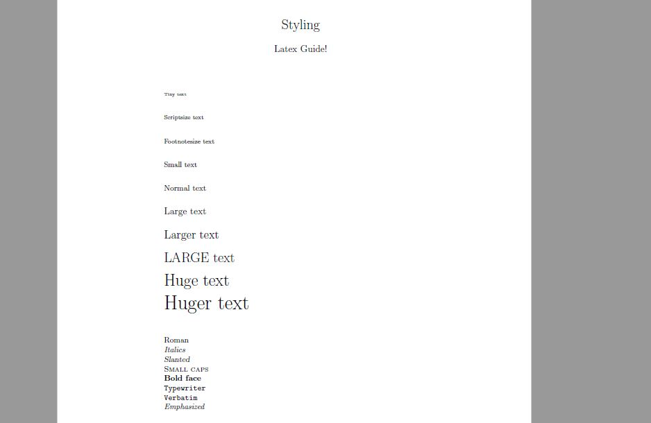

## Styling

##### Last time we learned how to start a very basic document. It's time we start adding things to it to make it look better.  

Let's start by creating a document the way we learned:

```latex
\documentclass{article}

\begin{document}
	Some text.
\end{document}
```

### What is a document without a title?

To create a title we are gonna use the command `\maketitle` **but wait** don't rush to go write that in your Tex editor, because you are gonna get an error:

```
No \title given
No \author given
```

LaTeX is asking you to provide him with both an author and a title. Let't give it some, how? Super easy, with the commands `\author{Your Name}` and `\title{Your title}`.

The only important thing to watch out for is that you have to give the author and title *before* using `\maketitle`.

`\maketitle` has to go inside our Document enviroment. But `\author` and `\title` not necesarily. I prefer writing this two commands in the preamble, but it's up to you.

With all this things our document should look something like this:

```latex
\documentclass{article}

\author{Latex Guide!}
\title{Styling}

\begin{document}
    \maketitle

    Some text.
\end{document}
```

<div align="center">

</div>


If you dont like the date you can use `\date{}`, writing the date you want inside the `{}`. If you want no date, you can just leave it empty.

### Font sizes

LaTeX has very funny names for font sizes that will make you always remember them, I will list their names below, the way of using them is with a `\` first and a set of `{}` with the text you want to resize. 

* tiny,
* scriptsize,
* footnotesize,
* small,
* normalsize,
* large,
* Large,
* LARGE,
* huge,
* Huge,

Here is an example of code:

```latex
        \noindent\tiny{Tiny text}\\
	\scriptsize{Scriptsize text}\\
	\footnotesize{Footnotesize text}\\
	\small{Small text}\\
	\normalsize{Normal text}\\
	\large{Large text}\\
	\Large{Larger text}\\
	\LARGE{LARGE text}\\
	\huge{Huge text}\\
	\Huge{Huger text}
```

And in this code there are two things you might not be familiar with. The first one is the `\noindent` command, what it does is simply remove the indent to the line, as that was the first line in the document, LaTeX automatically indents it, for demonstration purposes, I didn't want it like that.
The second thing is `\\`. In LaTeX when you do a simple line jump (pressing enter) the document will not take it into account, it will simply continue the line. If you do two enters, it will change the line without indenting the last one, and when we use `\\` it is considered as the end of a paragraph.


### Font styling

As expected, font stylings are as easy as font sizes, here is the list:

* `\textrm{}`: Roman,
* `\textit{}`: *Italics*,
* `\textsl{}`: Slanted,
* `\textsc{}`: Small caps,
* `\textbf{}`: **Bold face**,
* `\texttt{}`: Typewriter,
* `\verb||`: Verbatim,
* `\emph{}`: Emphasized,

```latex
        \noindent\textrm{Roman}\\
	\textit{Italics}\\
	\textsl{Slanted}\\
	\textsc{Small caps}\\
	\textbf{Bold face}\\
	\texttt{Typewriter}\\
	\verb|Verbatim| \\
	\emph{Emphasized}
```

So far, we have this document.

<div align="center">

</div>

Things are starting to look pretty good!

It is now time for us to make lists and columns to make this document look even better