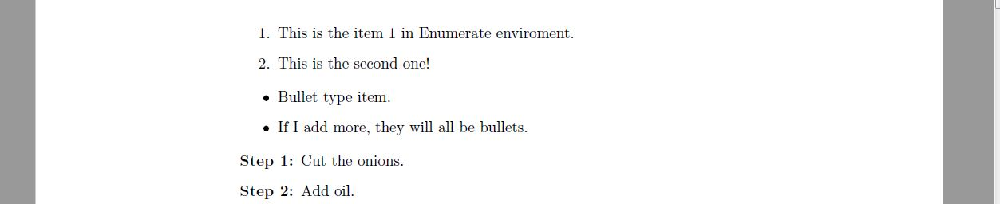
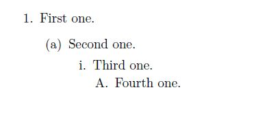
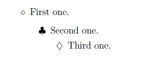

## Lists and Columns

##### Last time we ended up having a document with lots of font sizes and styles, but that it would have looked better using lists or columns. Let's start with lists.

### Lists

In LaTeX there are 3 types of lists, and as always, their names are super self explanatory.

1. `Enumerate`: Each item in the list is numbered, the numbers start with 1 each time we call the _enviroment_.
2. `Itemize`: Each item has a determined symbol (you can change which symbol you want),
3. `Description`: Used you add your own label in each item. Useful for steps.

This 3 ways of listing items are 3 different enviroments and each item is added with the command `\item` inside of the env. Here is an example:

```latex
\begin{enumerate}
		\item This is the item 1 in Enumerate enviroment.
		\item This is the second one!
	\end{enumerate}

	\begin{itemize}
		\item Bullet type item.
		\item If I add more, they will all be bullets.
	\end{itemize}

	\begin{description}
		\item[Step 1:] Cut the onions.
    \item[Step 2:] Add oil.
	\end{description}
```

<div align="center">

</div>

So far this is easy and, to be honest, kinda boring. But it's latex, and we know that latex is always fun because you can do whatever you want to make the document look the **exact** way you want it to. Let's make it fun!

#### Nested lists

Each one of the environments we used before can be used _inside_ another environment of the same or any other type to up to 4 levels of inclusion in the default configuration. And with that, we can end up having something like this:

```latex
\begin{itemize}
	\item First level in {\tt itemize}
	\begin{enumerate}
		\item First level in {\tt enumerate} (second level globaly)
		\begin{itemize}
			\item Second level in {\tt enumerate}
			(third globaly)
			\begin{enumerate}
				\item Second in {\tt enumerate}
				(fourth globaly)
				\item Second element in fourth level
			\end{enumerate}
			\item Back to third level globaly (second
			in {\tt itemize})
		\end{itemize}
		\item Second level (first one in {\tt enumerate})
	\end{enumerate}
	\item First level
\end{itemize}
```

<div align="center">

</div>

Things are starting to get better now, but it is still kinda weird, what if I don't like the `-` in that second itemize (and I don't). Well luckily for us, there is a way to change that!!

#### Changing items styles

The only environments we will actually wanna change are `enumerate` and `itemize` because in the `description` one we can do whatever we want already.

###### **Changing `enumerate`**

The default way latex enumerates our items is as follows:

```latex
\begin{enumerate}
	\item First one.
	\begin{enumerate}
		\item Second one.
		\begin{enumerate}
			\item Third one.
			\begin{enumerate}
				\item Fourth one.
			\end{enumerate}
		\end{enumerate}
	\end{enumerate}
\end{enumerate}
```

<div align="center">

</div>

Each level is represented with one command: `\theenumi`, `\theenumii`, `\theenumiii` and `\theenumiv`. And the labels used in each label are `\labelenumi`, `\labelenumii`, `\labelenumiii`, `\labelenumiv`. And if we want to change the behaviour of `enumerate` we have to do something called _redefine a command_ using the command `\renewcommand{old comand}{new command}` (didn't see that one coming did you?) just before our enumerate environment. If we wanted to change only the first two, to show a roman number in the first level and roman.letter in the second one it would look like this

```latex
%redefining the first level with \Roman, \roman would be i, ii, iii...
\renewcommand{\theenumi}{\Roman{enumi}}
\renewcommand{\labelenumi}{[\textbf{\theenumi}]}
%redefining the second level with \Alph, \aoman would be a, b, c...
\renewcommand{\theenumii}{\Alph{enumii}}
\renewcommand{\labelenumii}{[\textbf{\theenumi}.\textit{\theenumii}]}
\begin{enumerate}
	\item First one.
	\begin{enumerate}
		\item Second one.
		\item Second level again
	\end{enumerate}
	\item First level again
\end{enumerate}
```

<div align="center">

</div>

###### **Changing `itemize`**

As before, we have the default items as:

<div align="center">

</div>

Now for itemize we have the commands `\labelitemi`, `\labelitemii`, `\labelitemiii`, `\labelitemiv`. And they can take values such as: `\blacksquare`, `\textbullet`, `\circ`, `\clubsuit` or `\diamond`. **This value must be between `$`**. Observe that here it's not necessary to talk about order between items as we did in the `enumerate` environment with `theenumi`, because itemize only uses labels. Here is an example:

```latex
\renewcommand{\labelitemi}{$\circ$}
\renewcommand{\labelitemii}{$\clubsuit$}
\renewcommand{\labelitemiii}{$\diamondsuit$}
\begin{itemize}
	\item First one.
	\begin{itemize}
		\item Second one.
		\begin{itemize}
			\item Third one.
		\end{itemize}
	\end{itemize}
\end{itemize}
```

<div align="center">

</div>

The reason why the value of the itemize label (`\circ`,`\diamond`) has to go between `$` is something that we will understand better next time, when we talk about equations!
