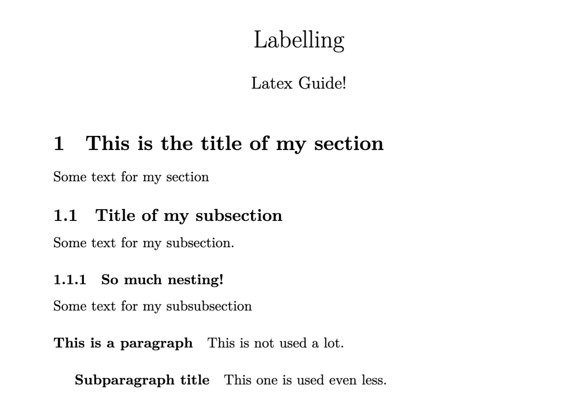
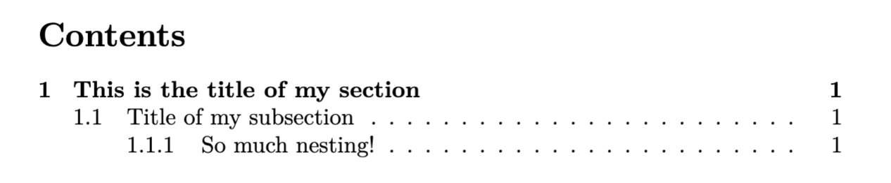
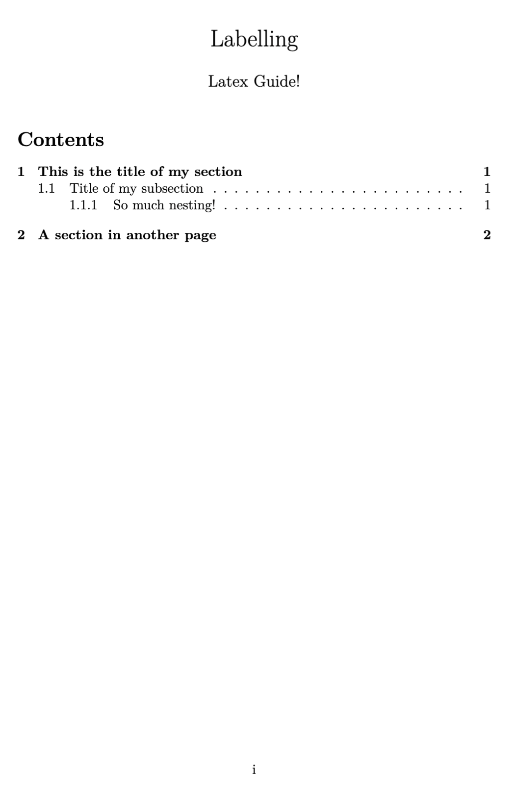
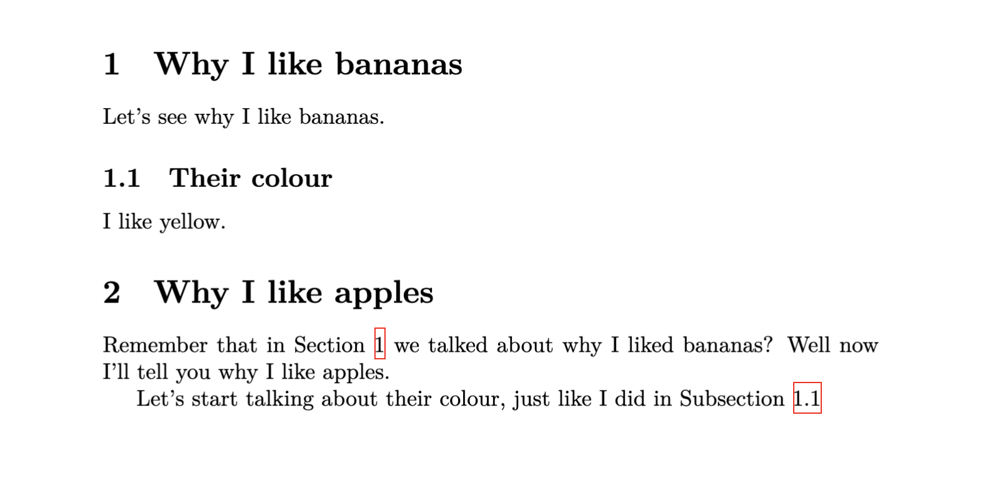

## Labelling

##### In this section we will learn how to create sections and how to refer the reader back to them.

### Sections

The type of separations that exist will depend on the document class that we chose. The most common document classes are **article** and **book**, so let's study the sections for those!

#### Sections for the **article** class

1. `\section{...}`
2. `\subsection{...}`
3. `\subsubsection{...}`
4. `\paragraph{...}`
5. `\subparagraph{...}`

Here's an example:

```latex
\section{This is the title of my section}

Some text for my section.

\subsection{Title of my subsection}

Some text for my subsection.

\subsubsection{So much nesting!}

Some text for my subsubsection

\paragraph{This is a paragraph}

This is not used a lot.

\subparagraph{Subparagraph title}

This one is used even less.

```

<div align="center">

</div>

The **book** class only adds the section `\chapter{...}`

### Table of contents

A good thing about using different sections is that we can add a TOC in our document. Adding it is extremely simple, just with the command `\tableofcontent` just after the title.

```latex
\begin{document}
  \maketitle
  \tableofcontent

  % Rest of the document

\end{document}
```

And this will result in something like:

<div align="center">

</div>

And we can play around with page numbering. Something that is usually done is to either have no number in the first page (the page with the title and TOC) or use Roman numbers for that page, and the rest Arabic. We can do this with LaTeX!

#### If you want no number in the current page

```latex
\begin{document}
  \maketitle
  \thispagestyle{empty}
  \tableofcontent

  % Rest of the document

\end{document}
```

#### If you want Roman number for the first one and Arabic for the rest

```latex
\begin{document}
  \maketitle
  \pagenumbering{roman}
  \tableofcontent
  \newpage
  \pagenumbering{arabic}

  % Rest of the document

\end{document}
```

As with list enumeration, you can change `roman` to `Roman` to have the first page with an uppercase Roman number (I) instead of a lowercase one (i).

<div align="center">

</div>

This table of contents is a bit boring, because it's not linking to the sections. That is solved with something extra that we have to add in our preamble `\usepackage{hyperref}`:

```latex
  \documentclass{article}
  \usepackage{hyperref}

  \author{Latex Guide!}
  \title{Labelling}
  \date{}

  \begin{document}
  % Rest of the document
```

### Labelling

Now, let's say you're in Section 6 and want the reader to remember something you talked about in Section 1, are you gonna make him scroll? No! That's where labelling is useful, and the best thing is that it's so simple!

Labelling works with two commands: `\label{...}` and `\ref{...}`, the label command will give a name to the section (and we'll see later that it also works with other things), and the ref command just references that label! As easy as that.

If we want our labelling to be functional, we have to add, just like with TOC, the hyperref package in our preamble

```latex
\documentclass{article}
\usepackage{hyperref}

\author{Latex Guide!}
\title{Labelling}
\date{}

\begin{document}
  \maketitle
  \pagenumbering{roman}
  \tableofcontents
  \newpage
  \pagenumbering{arabic}

  \section{Why I like bananas}\label{section:bananas}

  \subsection{Their colour}\label{subsection:bananascolour}
  I like yellow.

  \section{Why I like apples}\label{section:apples}

  Remember that in Section \ref{section:bananas}  we talked about why I liked bananas? Well now I'll tell you why I like apples.

  Let's start talking about their colour, just like I did in Subsection \ref{subsection:bananascolour}

\end{document}
```

And this looks like:

<div align="center">

</div>
