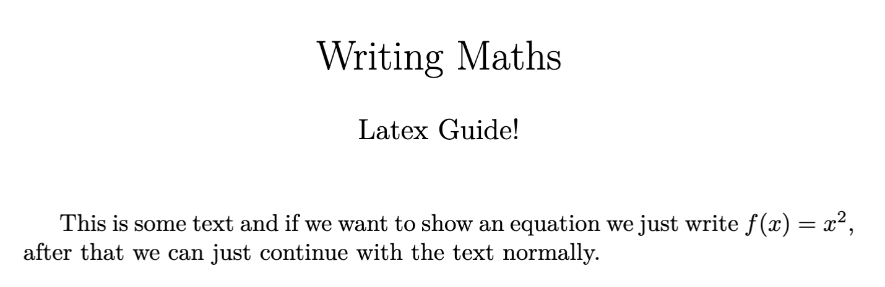
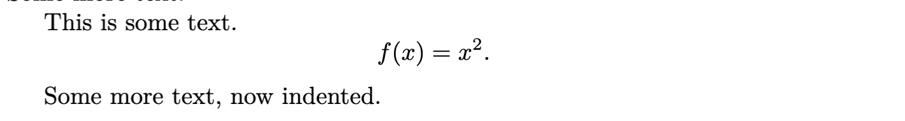
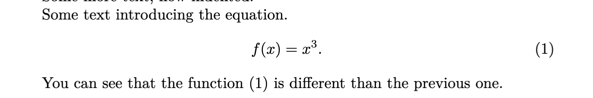
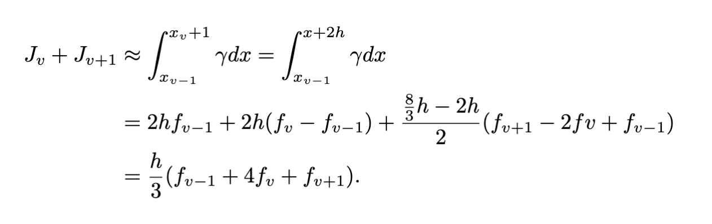

## Writing maths

##### In this section we will finally learn how to write maths equations using LaTeX!

There are two types of equations in LaTeX.

- Inline equations.
- Centred equation (this is not an 'official' name)

While learning how to display these equations, we will also learn some of the latex commands for fractions, exponents, subindexes, integrals, etc.

### Inline equations

To enter a maths environment in the middle of the text we use the dollar sign \$. For example if we write \$E = mc^2\$ it will produce $E = mc^2$. Very easy, isn't it?

Here's an example of a TeX document:

```latex
  \documentclass{article}

  \author{Latex Guide!}
  \title{Writing Maths}
  \date{}

  \begin{document}
    \maketitle
    This is some text and if we want to show an equation we just write $f(x) = x^2$, after that we can just continue with the text normally.
  \end{document}
```

<div align="center">

</div>

### Non-inline equations

Now let's see how to write a simple equation in the middle of the document. We will need to add a package for this (there are ways of not using this package, but eventually you'll need it anyway, so you're better off adding it now!)

```latex
  \usepackage{amsmath}
```

Let's start by unlabelled equations.
For this we will use the equation environment. And for the equation to be unlabelled, we will add an asterisk (\*) to the environment. Like this:

```latex
\begin{document}
  This is some text.
  \begin{equation*}
    f(x) = x^2.
  \end{equation*}
  Some more text.
\end{document}
```

And this will result in something like:

<div align="center">

</div>

Note that the phrase "Some more text" does not have indentation. To have it indented we should add another blank line:

```latex
\begin{document}
  This is some text.
  \begin{equation*}
    f(x) = x^2.
  \end{equation*}

  Some more text, now indented.
\end{document}
```

And this will result in something like:

<div align="center">

</div>

### Labelled equations

Great! We now know how to work with unlabelled equations, labelling them is very easy. We will be using something we learned in the previous section.

We have to add `\label{labelname}` to the equation. Personally, I like setting the names starting with "eq:...", so that's what we will use in the following examples.

In case you didn't, remember to add the package

```latex
\usepackage{amsmath}
```

Now to add a label to the equation we just don't use the asterisk (\*) in the environment, and we give it a label. We refer to that label using the command `\eqref{labelname}`

```latex
\begin{document}
  Some text introducing the equation.
  \begin{equation}\label{eq:cubed}
    f(x) = x^3.
  \end{equation}

  You can see that the function \eqref{eq:cubed} is different than the previous one.
\end{document}
```

This will look something like:

<div align="center">

</div>

From what we learned before you might notice that if we also have the package:

```latex
\usepackage{hyperref}
```

Then the number in the `\eqref` will be clickable and will take the reader to the correct equation.

### Align environment

Lots of times we have a very long calculation that doesn't fit in one line. These are typed into LaTeX using the **align** environment. Like equations, these can be labelled or unlabelled.

The align environment will use two new things: `\\` and `&`. The `\\` is used to jump one line, and the `&` is to mark the point where the equations will be aligned, usually after the first $=$ (or $\leq$, $\geq$) and before each of the subsequent $=$ (or $\leq$, $\geq$).

**Unlabelled align:**

```latex
\begin{align*}
	J_v+J_{v+1}&\approx \int_{x_{v-1}}^{x_v+1} \gamma dx=\int_{x_{v-1}}^{x+2h} \gamma dx \\
	&=2hf_{v-1}+2h(f_v-f_{v-1})+\frac{\frac{8}{3}h-2h}{2}(f_{v+1}-2fv+f_{v-1})\\
	&=\frac{h}{3}(f_{v-1}+4f_v+f_{v+1}).
	\end{align*}
```

Which looks like:

<div align="center">

</div>

That equation had a lot of symbols. Here's a list:

- $J_v$: The subindex $v$ is added with `_{v}`
- $\approx$: This is the `\approx` symbol.
- $\int_{a}^{b}$: The integral symbols is `\int`, the subindex and supraindex are added with `_{a}` and `^{b}`.
- $\frac{a}{b}$: Fractions are written using the command `\frac{a}{b}`.
